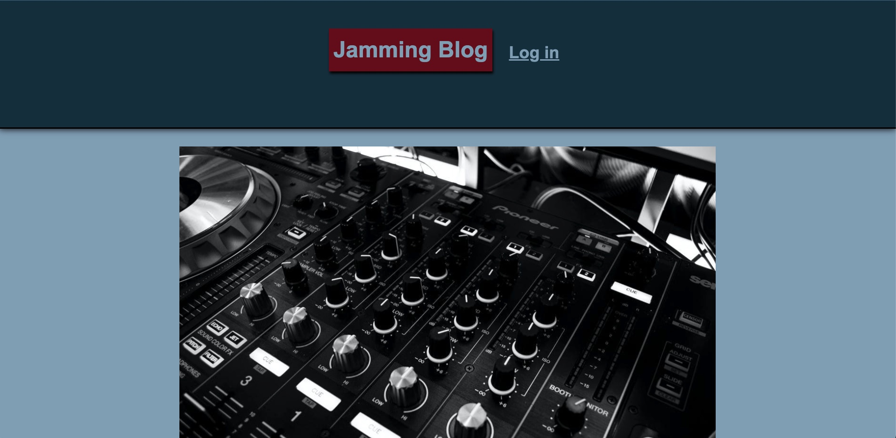
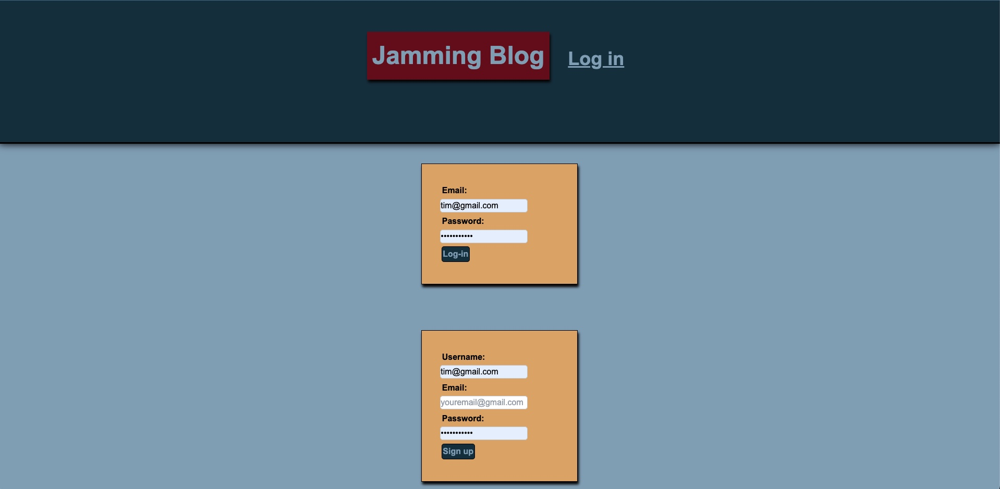
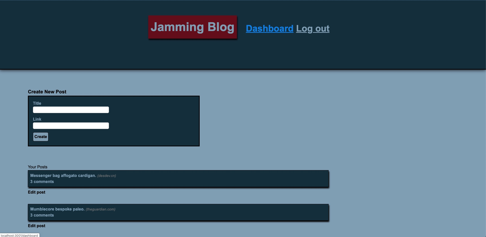

  # Jamming Blog

  # Table of Contents

  1. [Description](#Description)
  2. [Installation](#Installation)
  3. [Usage](#Usage)
  4. [License](#License)
  5. [Contibuting](#Contributing)
  6. [Tests](#Tests)
  7. [Questions](#Questions)

  ## Description 
    Jamming Blog is meant to be a place where you can discuss your favorite music and musicians amongst friends from the greater music community. Logging in is required, to keep the information secure and add an element of privacy but once you’re in you can see all of the posts and comments on those posts as well as write new posts and comments. As a user I want to be able to communicate with the world around me about the music that I love. I want to be able to make posts about that music in order to cultivate a deeper love for as well as enjoyment and appreciation of the music and musicians of my choice. I also want the greater community to be able to comment on my posts and edit their comments for typos or clarity.  

  ### Here is a view of the landing page once the server is running
  

  ### Here is a view of the Login Page
  

  ### Here is a view of the user's dashboard where they can Create their own blog posts.
  

  ### Here is a view of the Jamming Blog Posts where user's can read and comment on each others' posts.
  

  ## Installation

  Currently deployment via Heroku and running node server.js or npm start in the CLI from the root of the file.

  https://obscure-sierra-56263.herokuapp.com/

  ## Usage
  Once adding a login and logging in the user may view all of the blog posts on the Jamming Blog website. The may add comments to those posts or they may go and add a new blog post or else edit their posts and comments. 

  ## License
    

  ## Questions
 Our names are: Sam Williams (samwilliams281@gmail.com), Timothy Knight (haadelphos2001@gmail.com), and Vaughn Smith (vaughnsmith95@gmail.com). If you have questions please contact either one of us at the emails provided above.
  
